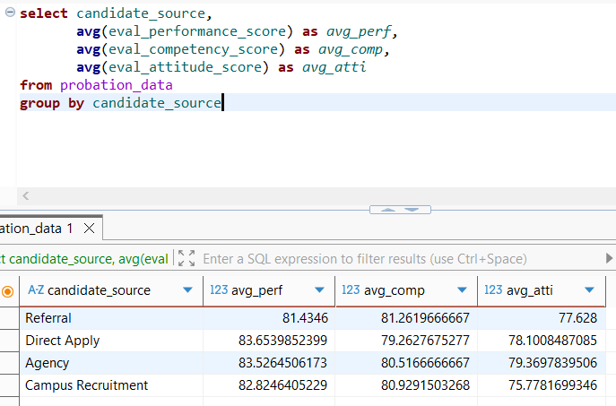
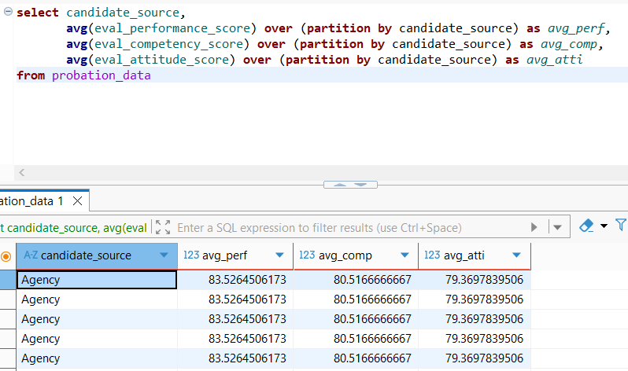
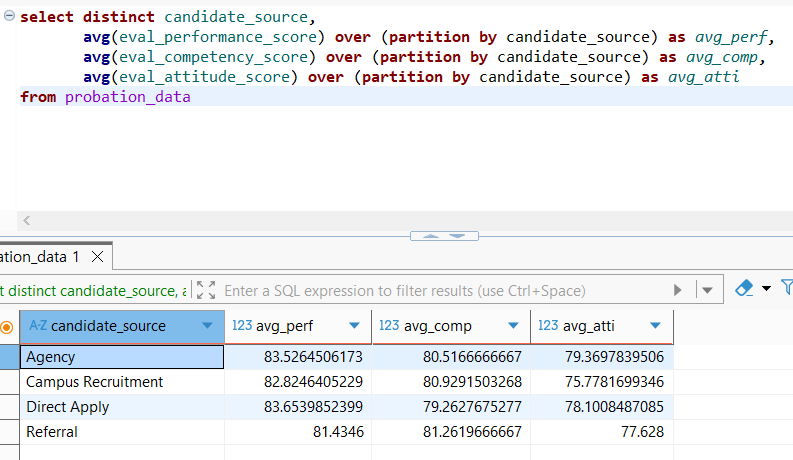

## 목차

* [1. 연산자 설명](#1-연산자-설명)
  * [1-1. `UNION ALL`](#1-1-union-all) 
  * [1-2. `INTERSECT`](#1-2-intersect)
  * [1-3. `EXCEPT`](#1-3-except)
* [2. 실전 예제: 통합 학습용 데이터셋 구성](#2-실전-예제-통합-학습용-데이터셋-구성)
  * [2-1. `PARTITION BY` 함수](#2-1-partitionby-함수)

## 1. 연산자 설명

### 1-1. `UNION ALL`

**UNION ALL** 함수는 UNION 을 할 때 **중복 행 제거 없이 모든 행을 반환** 하는 연산자이다.

* 예를 들어 다음 2개의 테이블을 UNION ALL 하면 가장 오른쪽 테이블이 된다.

| ```table_1```                       | ```table_2```                       | ```UNION ALL``` 결과                                          |
|-------------------------------------|-------------------------------------|-------------------------------------------------------------|
| **user_id**<br>1201<br>1202<br>1203 | **user_id**<br>1201<br>1204<br>1205 | **user_id**<br>1201<br>1202<br>1203<br>1201<br>1204<br>1205 |

* 기본 구문은 다음과 같다.

```
SELECT column_1, column_2, ... FROM table_1
UNION ALL
SELECT column_1, column_2, ... FROM table_2
```

### 1-2. `INTERSECT`

**INTERSECT** 는 **컬럼 개수와 데이터 유형이 동일한** 두 테이블에서, **서로 동일하게 존재하는 데이터 (교집합)** 를 반환하는 연산자이다.

* 기본 구문은 다음과 같다.

```
SELECT column_1, column_2, ... FROM table_1
INTERSECT
SELECT column_1, column_2, ... FROM table_2
```

### 1-3. `EXCEPT`

**EXCEPT** 는 **`table_1`에는 존재하지만 `table_2`에는 존재하지 않는 데이터 (차집합)** 를 구하는 연산자이다.

* 기본 구문은 다음과 같다.

```
SELECT column_1, column_2, ... FROM table_1
EXCEPT
SELECT column_1, column_2, ... FROM table_2
```

## 2. 실전 예제: 통합 학습용 데이터셋 구성

### 2-1. `PARTITION_BY` 함수

* 참고: [GROUP BY 함수](02_02_generate_aggregate_feature.md#1-함수-기본-설명)

`PARTITION_BY` 함수는 특정 기준을 이용하여 grouping 을 하는 함수이다.

* 기본 구문: `(집계 함수) OVER (PARTITION BY column_name [ORDER BY ...])`
* `GROUP BY` 와의 차이점은 **Grouping 후에도 각 레코드들이 집계되지 않고 상세 정보가 유지** 된다는 것이다.
  * 따라서 `GROUP BY` 와 같은 효과를 보려면 `SELECT DISTINCT` 식으로 해야 한다.

| 구분                  | `GROUP BY` 결과                      | `PARTITION BY` 결과                  |
|---------------------|------------------------------------|------------------------------------|
| 기본                  |  |  |
| ```DISTINCT``` 사용 시 |                                    |  |
